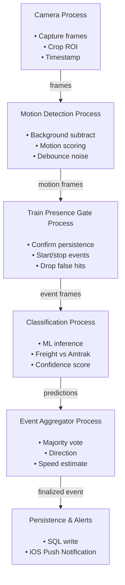

# Tyler's Train Detector
Components for a system used to identify and detect trains on the Union Pacific Austin Subdivision line.

This is my first attempt at a CV project... so don't judge :)

Included in this repo:
- All train detection logic
- API to expose train data stored in SQL
- Simple HTML dashboard for viewing train stats

## (Ideal) Process Diagram
