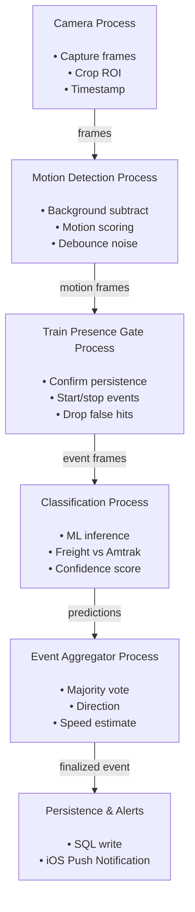

# TrainVision ATX

TrainVision ATX is a computer vision system for detecting and tracking trains along the Union Pacific Austin Subdivision line in Downtown Austin, Texas.
The project is entirely self-hosted on a Rasperry Pi in my apartment, giving insight on live and historical train activity data.

Live demo: http://trains.tylerroz.com

## Overview

This project is deployed on a Raspberry Pi 4 and operates as a self-contained system responsible for:

- Capturing a live camera feed (netcam pointed at the tracks)
- Detecting train motion using computer vision
- Persisting train events to a database
- Serving a REST API and web dashboard over the public internet

## Key Features

- Real-time train detection using Python and OpenCV
- REST API for querying recent and historical train activity
- MySQL-backed storage layer
- HTML+JS dashboard for monitoring train events and system status
- Edge deployment on Raspberry Pi hardware

## Tech Stack

- Python
- OpenCV (CV2)
- Apache (host the dashboard)
- Flask (API endpoints)
- MySQL
- HTML, CSS, JavaScript
- Raspberry Pi 4 running Debian-ish

## Networking and Deployment

The Raspberry Pi runs the full application stack locally and serves HTTP traffic directly to external clients. This project required sharpening my networking skills, doing the following:

- Setting up Dynamic DNS (DDNS) to handle a non-static ISP-assigned public IP
- Router port forwarding for configuration
- Static local IP assignment for the Raspberry Pi + netcam

## Motivation

I built this project for a couple reasons, namely:

- To enjoy coding again! After only doing corporate work for a few years, I had lost the joy of building something for fun
- Build a computer vision product for the first time
- I've been wanting to do a "Pi Project" for a while now, this was a great opportunity
- The train comes by every day, and it felt like wasted potential not doing something nerdy with that.

## (Ideal) Process Diagram
