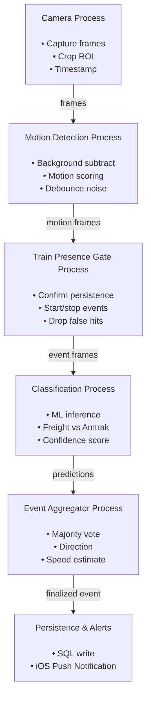

# TrainVision ATX

TrainVision ATX is a computer vision system for detecting and tracking trains along the Union Pacific Austin Subdivision line in Downtown Austin, Texas.
The project is entirely self-hosted on a Rasperry Pi in my apartment, giving insight on live and historical train activity data.

Live demo: http://trains.tylerroz.com

## Overview

This project is deployed on a Raspberry Pi 4 and operates as a self-contained system responsible for:

- Capturing a live camera feed (netcam pointed at the tracks)
- Detecting train motion using computer vision
- Persisting train events to a database
- Serving a REST API and web dashboard over the public internet

## Key Features

- Real-time train detection using Python and OpenCV
- REST API for querying recent and historical train activity
- MySQL-backed storage layer
- HTML+JS dashboard for monitoring train events and system status
- Edge deployment on Raspberry Pi hardware

## Tech Stack

- Python
- OpenCV (CV2)
- Apache (host the dashboard)
- Flask (API endpoints)
- MySQL
- HTML, CSS, JavaScript
- Raspberry Pi 4 running Debian-ish

## Networking and Deployment

The Raspberry Pi runs the full application stack locally and serves HTTP traffic directly to external clients. This project required sharpening my networking skills, doing the following:

- Setting up Dynamic DNS (DDNS) to handle a non-static ISP-assigned public IP
- Router port forwarding for configuration
- Static local IP assignment for the Raspberry Pi + netcam

## Live Stream (HLS via MediaMTX)

The dashboard exposes a clean (overlay-free) live view of the camera at `/live.html`, powered by [MediaMTX](https://github.com/bluenviron/mediamtx). MediaMTX runs as its own systemd service alongside the detector; it pulls H.264 from the netcam over RTSP and republishes it as HLS, so the browser can play the stream natively in a `<video>` tag — including the system player on iOS Safari (AirPlay, Picture-in-Picture, fullscreen).

**Why this exists separately from the detector:**

The Python detector also serves an MJPEG preview on `:8080`, but that stream has the ROI rectangle and motion mask drawn on top for debugging, and MJPEG isn't a "real" video format (no native player UI, no AirPlay, no PiP). MediaMTX gives the public dashboard a proper video stream without me having to transcode anything — it just remuxes the existing H.264 NAL units into HLS segments, which is nearly free CPU-wise on a Pi 4.

**Lifecycle:**

- MediaMTX starts at Pi boot via systemd (`deploy/mediamtx.service`), independent of `main.py`. The detector can be restarted without affecting the live stream.
- `sourceOnDemand: yes` in `mediamtx.yml` — MediaMTX only opens the camera RTSP connection when at least one viewer is actively watching, freeing a connection slot when nobody's looking.
- Apache reverse-proxies `/hls/` → `127.0.0.1:8888` (where MediaMTX serves HLS), with a `Header edit Location` rule to keep MediaMTX's cookie-check redirect inside the `/hls/` mount.

**Files involved:**

- `mediamtx.yml` — MediaMTX config (camera URL, ports, on-demand behavior)
- `deploy/mediamtx.service` — systemd unit
- `dashboard/live.html` — `<video>` element with hls.js shim for non-Safari browsers

## Motivation

I built this project for a couple reasons, namely:

- To enjoy coding again! After only doing corporate work for a few years, I had lost the joy of building something for fun
- Build a computer vision product for the first time
- I've been wanting to do a "Pi Project" for a while now, this was a great opportunity
- The train comes by every day, and it felt like wasted potential not doing something nerdy with that.

## (Ideal) Process Diagram

```mermaid
flowchart TD
    A[Camera Process<br/><br/>• Capture frames<br/>• Crop ROI<br/>• Timestamp]
    -->|frames| B[Motion Detection Process<br/><br/>• Background subtract<br/>• Motion scoring<br/>• Debounce noise]

    B -->|motion frames| C[Train Presence Gate Process<br/><br/>• Confirm persistence<br/>• Start/stop events<br/>• Drop false hits]

    C -->|event frames| D[Classification Process<br/><br/>• ML inference<br/>• Freight vs Amtrak<br/>• Confidence score]

    D -->|predictions| E[Event Aggregator Process<br/><br/>• Majority vote<br/>• Direction<br/>• Speed estimate]

    E -->|finalized event| F[Persistence & Alerts<br/><br/>• SQL write<br/>• iOS Push Notification]

```